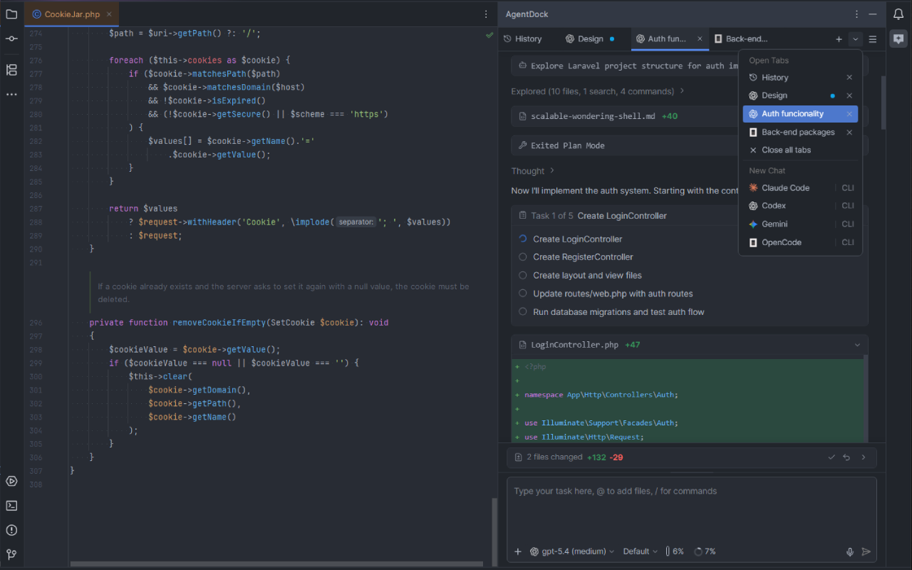

# OpenCode Dock

JetBrains plugin that brings OpenCode into a dedicated IDE tool window, following the active IDE theme.

## Highlights

- OpenCode runtime installation, update, and authentication inside the plugin.
- ACP-based communication with the OpenCode runtime.
- Structured chat output for tool calls, thinking blocks, plans, commands, diffs, and file edits.
- File change review with accept/revert from the IDE.
- Inline file references, code references, slash commands, @mentions, and image paste.
- Chat history with rename, delete, bulk delete, fork, and resume flows.
- Model selection with provider-based grouping derived from OpenCode model IDs.
- MCP server configuration, prompt library, system instructions, and commit message generation.
- Status bar quota widget and Windows voice input.

## Requirements

- JetBrains IDE based on IntelliJ Platform 2025.1 or newer.
- OpenCode uses the IDE terminal for some authentication and runtime flows.
- On macOS and Linux, installing the runtime requires `curl` and `tar`.

## Stack

- Backend: Kotlin + Gradle
- Frontend: React + TypeScript + Tailwind
- Runtime protocol: ACP (`com.agentclientprotocol:acp`)

## Screenshot

